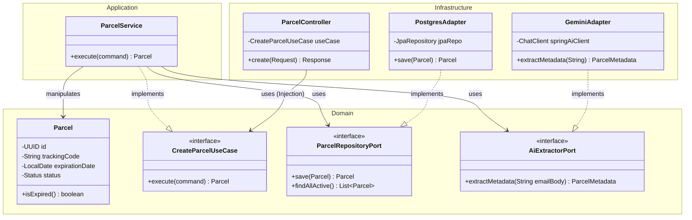

# Architecture Technique : Parcel-Flow

| Méta-donnée | Détail |
| :--- | :--- |
| **Projet** | Parcel-Flow |
| **Type** | Architecture Hexagonale (Ports & Adapters) |
| **Version** | 1.0.0 |
| **Auteur** | Winston (Architecte) |
| **Status** | **VALIDATED** |

## 1. Vision Architecturale

Ce projet est un "Dojo" technique. L'objectif n'est pas la simplicité du code (CRUD), mais la **pureté architecturale** et la **résilience**.
Nous appliquons une **Architecture Hexagonale Stricte**.

### Principes Directeurs
1.  **Indépendance du Framework :** Le code métier (`domain`) ne contient **AUCUNE** annotation Spring, Jakarta ou bibliothèque tierce (sauf Lombok/SLF4J si toléré, sinon pur Java).
2.  **Inversion de Dépendance :** Les couches externes (Infrastructure) dépendent du Domaine. Le Domaine ne dépend de rien.
3.  **Testing Strategy (Pyramide) :**
    * **Métier :** Tests unitaires purs (rapides).
    * **Acceptance :** Cucumber (Gherkin) pilotant les Use Cases.
    * **Intégration :** Testcontainers pour les Adapters (Gmail, Postgres, Gemini).

---

## 2. Structure du Monorepo

L'organisation des fichiers reflète la séparation physique des responsabilités.

```text
parcel-flow-monorepo/
├── .github/
│   └── workflows/
│       └── ci.yml                # Pipeline CI/CD unifié
├── backend/                      # Spring Boot 3.x
│   ├── src/
│   │   ├── main/java/com/parcelflow/
│   │   │   ├── domain/           # 🛑 COEUR MÉTIER (Pur Java)
│   │   │   │   ├── model/        # Entités (Parcel, EmailRaw)
│   │   │   │   ├── port/         # Interfaces (Ports)
│   │   │   │   │   ├── in/       # Use Cases (ex: ProcessEmailUseCase)
│   │   │   │   │   └── out/      # SPI (ex: ParcelRepository, AiExtractor)
│   │   │   │   └── exception/    # Domain Exceptions
│   │   │   ├── application/      # ORCHESTRATION
│   │   │   │   └── service/      # Implémentation des Use Cases
│   │   │   ├── infrastructure/   # 🔌 ADAPTERS (Spring Framework)
│   │   │   │   ├── config/       # Beans Spring, Swagger
│   │   │   │   ├── in/           # Driving Adapters
│   │   │   │   │   ├── web/      # RestControllers
│   │   │   │   │   └── job/      # Schedulers (Gmail Polling)
│   │   │   │   └── out/          # Driven Adapters
│   │   │   │       ├── persistence/ # JPA/Hibernate + Mapper Domain<->Entity
│   │   │   │       ├── gmail/       # Client API Gmail
│   │   │   │       └── ai/          # Spring AI (Gemini Impl)
│   │   │   └── ParcelFlowApplication.java
│   │   └── test/
│   │       ├── java/.../acceptance/ # 🥒 Cucumber Runners & Steps
│   │       └── resources/features/  # Fichiers .feature (Gherkin)
│   ├── pom.xml
│   └── Dockerfile
├── frontend/                     # React Native (Expo)
│   ├── src/
│   │   ├── assets/
│   │   ├── components/           # UI Components (RN Paper)
│   │   ├── features/             # Feature-based folders
│   │   │   ├── dashboard/
│   │   │   ├── archive/
│   │   │   └── scanner/
│   │   ├── navigation/           # Expo Router / React Navigation
│   │   ├── services/             # API Clients (Axios/TanStack Query)
│   │   ├── store/                # Zustand Stores
│   │   ├── theme/                # Design Tokens (Colors, Type)
│   │   └── utils/
│   ├── app.json
│   ├── package.json
│   └── tsconfig.json
├── infra/                        # Infrastructure locale
│   └── docker-compose.yml        # Postgres local
└── README.md
```

---

## 3. Diagramme de Classes (Isolation Domaine)

Ce diagramme  illustre comment le cœur (Domain) est protégé des détails techniques (Spring, API externes).



---

## 4. Stack Technique & Décisions

### 4.1 Backend (Le Cœur Robuste)
* **Domain :** Java 21 Record & Classes. Aucune dépendance externe.
* **Testing :**
    * **Cucumber :** Situé dans `src/test/resources/features`. Définit le contrat fonctionnel.
    * **Testcontainers :** Lance un vrai conteneur Postgres et un MockServer pour Gmail/Gemini lors des tests d'intégration.
* **AI :** `GeminiAdapter` implémente `AiExtractorPort`. Utilisation de `ChatClient` de Spring AI pour communiquer avec le modèle.

### 4.2 Frontend (L'Interface Vibe)
* **UI Kit :** React Native Paper pour les composants "Material 3" (Cards, Chips, FAB).
* **State :** Zustand pour gérer la liste des colis et l'état "Offline".
* **Navigation :** Expo Router (File-based routing).

---

## 5. Pipeline CI/CD (.github/workflows/ci.yml)

Ce pipeline valide le code à chaque Push/PR. Il échoue si les tests Gherkin ou le Linting échouent.

```yaml
name: Parcel-Flow CI

on:
  push:
    branches: [ "main" ]
  pull_request:
    branches: [ "main" ]

jobs:
  # ------------------------------------------------------------------
  # JOB 1: BACKEND VALIDATION (Java + ATDD)
  # ------------------------------------------------------------------
  backend-ci:
    runs-on: ubuntu-latest
    defaults:
      run:
        working-directory: ./backend

    services:
      # Service Postgres pour les tests qui n'utilisent pas Testcontainers (optionnel si TC partout)
      postgres:
        image: postgres:15-alpine
        env:
          POSTGRES_DB: parcelflow
          POSTGRES_USER: test
          POSTGRES_PASSWORD: test
        ports:
          - 5432:5432
        options: >-
          --health-cmd pg_isready
          --health-interval 10s
          --health-timeout 5s
          --health-retries 5

    steps:
      - uses: actions/checkout@v4

      - name: Set up JDK 21
        uses: actions/setup-java@v4
        with:
          java-version: '21'
          distribution: 'temurin'
          cache: maven

      - name: Build with Maven & Run Unit Tests
        run: ./mvnw test

      - name: Run ATDD (Cucumber Acceptance Tests)
        # Sépare l'exécution pour bien distinguer Unit vs Acceptance dans les logs
        run: ./mvnw verify -Dtest="**/RunCucumberTest.java"

      - name: Archive Test Results
        if: always()
        uses: actions/upload-artifact@v4
        with:
          name: backend-test-reports
          path: backend/target/surefire-reports

  # ------------------------------------------------------------------
  # JOB 2: FRONTEND VALIDATION (React Native)
  # ------------------------------------------------------------------
  frontend-ci:
    runs-on: ubuntu-latest
    defaults:
      run:
        working-directory: ./frontend

    steps:
      - uses: actions/checkout@v4

      - name: Setup Node.js
        uses: actions/setup-node@v4
        with:
          node-version: '20'
          cache: 'npm'
          cache-dependency-path: frontend/package-lock.json

      - name: Install Dependencies
        run: npm ci

      - name: Type Check (TypeScript)
        run: npm run tsc

      - name: Linting
        run: npm run lint

      - name: Unit Testing
        run: npm test

  # ------------------------------------------------------------------
  # JOB 3: PREVIEW NOTIFICATION (Placeholder)
  # ------------------------------------------------------------------
  notify-preview:
    needs: [backend-ci, frontend-ci]
    runs-on: ubuntu-latest
    if: github.event_name == 'pull_request'
    steps:
      - name: Comment PR
        uses: thollander/actions-comment-pull-request@v2
        with:
          message: |
            ✅ **CI Passed!** Ready for deployment to:
            - 🚆 Railway (Backend)
            - 📱 Expo EAS (Frontend)
            
            *(Deployment jobs trigger on merge or specific labels)*
```