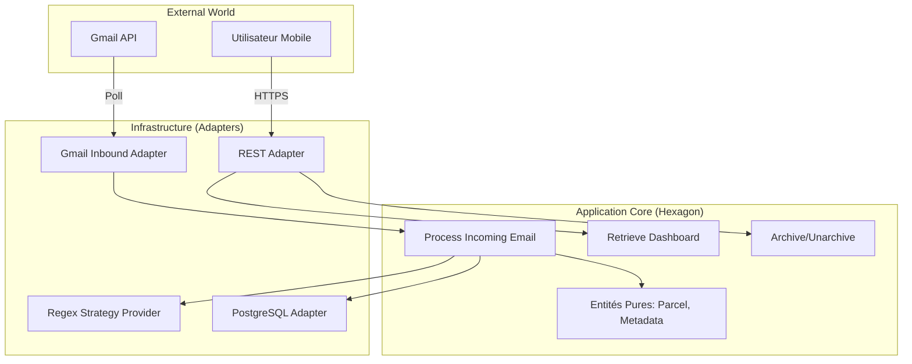

---
stepsCompleted:
  - step-01-init
  - step-02-context
  - step-03-starter
  - step-04-decisions
  - step-05-patterns
  - step-06-structure
  - step-07-validation
inputDocuments:
  - docs/prd.md
  - docs/planning-artifacts/ux-design-specification.md
  - docs/product-brief.md
  - docs/planning-artifacts/epics.md
workflowType: 'architecture'
project_name: 'parcel-flow'
user_name: 'Antoine'
date: '2026-01-19T13:23:43.627Z'
---

# Architecture Technique : Parcel-Flow

| Méta-donnée | Détail |
| :--- | :--- |
| **Projet** | Parcel-Flow (Portfolio Showcase) |
| **Type** | Architecture Hexagonale Stricte (Ports & Adapters) |
| **Version** | 1.0.0 |
| **Status** | **APPROVED FOR DEVELOPMENT** |
| **Tech Stack** | Java 21, Spring Boot 3.3, Expo SDK 52, Gemini 3 Flash |

---

## 1. Vision & Philosophie
**Parcel-Flow** est une application mobile conçue pour réduire la friction lors du retrait de colis (Vinted, Mondial Relay, etc.).
Au-delà du produit, ce projet est un **Dojo Technique**. Il démontre la capacité à maintenir une architecture propre et découplée dans un contexte moderne.

### Principes Architecturaux (Non-Négociables)
1.  **Hexagone Strict (Domain Purity) :** Le code métier (`domain`) est **Pur Java 21**. Il ne contient **AUCUNE** annotation de framework (pas de `@Service`, `@Entity`, `@JsonProperty`).
2.  **Inversion de Dépendance :** L'Infrastructure dépend du Domaine. Le Domaine ne dépend de rien.
3.  **ATDD First :** Le comportement est défini par des tests d'acceptation (Gherkin) avant l'implémentation.
4.  **Mobile First & Offline :** L'UI est pensée pour un usage en zone blanche (sous-sol, magasin) avec une synchro optimiste.

---

## 2. High Level Architecture

Le système orchestre l'extraction intelligente de données depuis des emails non structurés vers une interface mobile structurée.



---

## 3. Tech Stack (Golden Stack)

Cette configuration est impérative pour garantir la compatibilité des agents IA.

| Catégorie | Technologie | Version | Rôle & Rationale |
| :--- | :--- | :--- | :--- |
| **Backend Lang** | **Java** | **21 (LTS)** | Records, Pattern Matching, Virtual Threads. |
| **Framework** | **Spring Boot** | **3.3+** | Configuration simplifiée, écosystème mature. |
| **Parsing Engine** | **Java Regex** | **Native** | Extraction déterministe par Provider (Strategy Pattern). |
| **HTML Parser** | **Jsoup** | **1.17+** | Nettoyage et traversée du DOM avant Regex (si nécessaire). |
| **Architecture** | **ArchUnit** | **1.0+** | "Linter d'Architecture" bloquant les violations dans la CI. |
| **Database** | **PostgreSQL** | **16** | Stockage relationnel + JSONB (Métadonnées). |
| **Frontend** | **React Native (Expo)** | **SDK 52+** | Framework mobile. Router v3. |
| **UI Library** | **RN Paper** | **5.x** | Material Design 3 (Theming, Accessibility). |
| **State** | **Zustand** | **4.5+** | Store global minimaliste + Persistance locale. |
| **Testing (Unit)** | **Jest** | **Expo Preset** | Standard Expo (`jest-expo`) + React Testing Library. |
| **Testing (Acceptance)** | **Cucumber JVM** | **7.x** | Validation métier (Gherkin). |
| **Testing (Integration)** | **Testcontainers** | **1.19+** | Vrais environnements (Postgres, MockServer) en tests. |

---

## 4. Domain Design (Le Cœur)

Le dossier `backend/src/main/java/com/parcelflow/domain` est sanctuarisé.

### 4.1 Entités & Value Objects
Le modèle anémique est banni. Nous utilisons des **Value Objects** pour encapsuler la validation et la logique métier.

```java
// --- Value Objects (Immutables & Validés) ---

public record ParcelId(UUID value) {
    public ParcelId { java.util.Objects.requireNonNull(value); }
    public static ParcelId random() { return new ParcelId(UUID.randomUUID()); }
}

public record TrackingNumber(String value) {
    public TrackingNumber {
        if (value == null || value.isBlank()) throw new IllegalArgumentException("Tracking Number required");
    }
}

public record PickupPoint(
    String name,       // ex: "ÉPICERIE DES MOINES"
    String rawAddress, // ex: "8 RUE DE L ÉGLISE, 69210 EVEUX"
    String openingHours // ex: "08:30 - 12:30 / 15:00 - 19:00"
) {}

public record PickupCode(
    String humanCode,  // ex: "411612"
    String qrContent   // Contenu brut pour régénération du QR Code UI
) {}

public record Recipient(String name) {} // ex: "Noura Chevin"

public enum Carrier {
    VINTED, MONDIAL_RELAY, CHRONOPOST, UNKNOWN
}

// --- Root Aggregate ---

public record Parcel(
    ParcelId id,
    Carrier carrier,
    TrackingNumber trackingNumber,
    Recipient recipient,
    PickupPoint pickupPoint,
    PickupCode pickupCode,
    LocalDate deadlineDate,
    ParcelStatus status
) {
    public boolean isUrgent() {
        return status != ParcelStatus.ARCHIVED 
            && deadlineDate.isBefore(LocalDate.now().plusDays(2));
    }
}
```

### 4.2 Ports Primaires (Use Cases)
Ces interfaces définissent ce que l'application **PEUT FAIRE**.

* `ProcessIncomingEmailUseCase` : Orchestrateur principal (Fetch Mail -> Extract AI -> Save).
* `RetrieveDashboardUseCase` : Récupère les colis actifs triés par urgence.
* `ArchiveParcelUseCase` : Passe un colis en `ARCHIVED`.
* `UnarchiveParcelUseCase` : Restaure un colis en `PENDING`/`RECEIVED`.

### 4.3 Ports Secondaires (Driven Interfaces)
Ces interfaces définissent ce dont l'application **A BESOIN**.

* `InformationExtractorPort` : `ExtractionResult extract(String rawText, ProviderType provider)`
    * *Implémentation :* `RegexParserAdapter` (Infrastructure) qui sélectionne la bonne stratégie (Chronopost, Mondial Relay, Vinted).
* `ParcelRepositoryPort` : CRUD operations.
    * *Implémentation :* `PostgresJpaAdapter` (Infrastructure).

---

## 5. Infrastructure & DevOps Strategy

### 5.1 Pipeline CI/CD (GitHub Actions)
Le pipeline applique la stratégie "Supervisor" : validation visuelle obligatoire.

1.  **Backend Quality Gate :**
    * Compilation Java 21.
    * **ArchUnit Check :** Bloque si le package `domain` dépend de `org.springframework` ou utilise `java.lang.reflect`.
    * **Tests :** Unitaires + Cucumber + Integration (Testcontainers).
2.  **Preview Apps :**
    * **Backend :** Déploiement sur **Railway** (URL éphémère `pr-123-api.railway.app`).
    * **Frontend :** Publication sur **Expo EAS Update** (Channel `preview`).
3.  **Notification PR :**
    * Le bot poste un commentaire avec un **QR Code**.
    * *Action Superviseur :* Scan QR Code -> Test sur mobile réel -> Merge.

### 5.2 Web vs Mobile Workflow
* **Dev Loop (Local) :** Le développeur PEUT utiliser `npm run web` pour itérer rapidement sur l'UI (Layout, Couleurs).
* **Validation Loop (PR) :** La validation DOIT se faire sur mobile (via Expo Go / QR Code) pour garantir le fonctionnement des API natives (Luminosité, Haptique).

---

## 6. Structure du Monorepo

```text
parcelflow-monorepo/
├── .github/workflows/      # CI/CD Pipelines
├── docs/                   # PRD, Architecture, ADRs
├── backend/                # Spring Boot Application
│   ├── src/main/java/com/parcelflow/
│   │   ├── domain/         # 🛡️ PURE JAVA (No Spring)
│   │   │   ├── model/
│   │   │   └── ports/      # Interfaces (In/Out)
│   │   ├── application/    # Orchestration des Use Cases
│   │   └── infrastructure/ # 🔌 Adapters (Spring, DB, Gemini)
│   │       ├── api/        # REST Controllers
│   │       ├── persistence/# JPA Repositories
│   │       └── ai/         # Spring AI Client
│   └── pom.xml
├── frontend/               # Expo Application
│   ├── src/
│   │   ├── app/            # Expo Router (Filesystem routing)
│   │   ├── components/     # UI Components (Paper)
│   │   ├── core/           # Business Logic (Services, Stores)
│   │   └── theme/          # Design Tokens
│   └── package.json
└── docker-compose.yml      # Local Dev (Postgres, Mailpit)
```

---

## 7. Next Steps (Handoff)

### Pour l'Agent Product Owner :
* Créer les User Stories Gherkin pour l'Epic 1 ("Foundation") et l'Epic 2 ("Ingestion").
* Focus sur le fichier `.feature` du Use Case `ProcessIncomingEmail`.

### Pour l'Agent Développeur :
1.  Initialiser le Monorepo avec le squelette Maven (Back) et Expo (Front).
2.  Mettre en place la règle **ArchUnit** immédiatement pour empêcher la dette technique.
3.  Implémenter le `Parcel` (Record) et le `ParcelRepositoryPort` avant toute base de données.

## Project Context Analysis

### Requirements Overview

**Functional Requirements:**
L'architecture doit supporter un flux de données unidirectionnel partant de Gmail (API) vers Gemini (Extraction) puis vers PostgreSQL (Stockage métier) et enfin vers l'App Mobile. Le groupement par lieu (Location Clustering) introduit une complexité supplémentaire dans le domaine pour agréger les statuts d'urgence.

**Non-Functional Requirements:**
*   **Purity (NFR2.1) :** Le domaine doit être 100% découplé.
*   **Privacy (NFR1.1) :** Éphémérité des données sensibles.
*   **Offline Availability (NFR3.1) :** Implique une stratégie de synchronisation et de cache robuste côté frontend.

**Scale & Complexity:**
Le projet est un "Dojo" : la complexité réside dans la rigueur architecturale plutôt que dans le volume massif de données.

- Primary domain: Full-stack (Java/Spring Boot + React Native/Expo)
- Complexity level: Medium (High Architectural Rigor)
- Estimated architectural components: ~6 (Adapters: Gmail, Gemini, DB, API REST + Domain + Mobile App)

### Technical Constraints & Dependencies
*   Java 21 / Spring Boot 3.3 (Backend)
*   React Native Expo SDK 52 (Frontend)
*   Google Gemini 3 Flash (AI)
*   OAuth2 Gmail restricted scope.

### Cross-Cutting Concerns Identified

## Core Architectural Decisions

### Data Architecture
*   **Modélisation Lieu (PickupPoint) :** Entité séparée (ManyToOne) et non Value Object imbriqué. Permet de centraliser les horaires d'ouverture et d'optimiser le groupement par lieu au niveau SQL/Backend.

### API & Communication
*   **Format d'échange :** Ressource agrégée `/pickup-points`. Le backend renvoie directement la structure groupée `{ pickupPoint: {...}, parcels: [...] }` pour simplifier le frontend.

## Implementation Patterns & Consistency Rules

### Code & Naming Conventions
*   **Java (Backend) :** Standard Spring/Google (PascalCase classes, camelCase methods). Packages `lowercase`.
*   **TypeScript (Frontend) :** `PascalCase.tsx` pour composants, `camelCase.ts` pour hooks.
*   **Interfaces :** Pas de préfixe `I` (ex: `Parcel` et non `IParcel`).

### Hexagonal Purity Rules (Enforced by ArchUnit)
1.  **No Spring in Domain :** Interdiction d'importer `org.springframework.*` dans le package `domain`.
2.  **No Reflection in Domain :** Interdiction stricte de `java.lang.reflect` dans le `domain`. Les objets du domaine doivent être simples, explicites et instanciables directement (POJO/Records). Pas de "magie".

### Error Handling Pattern
*   **Standard API :** Utilisation du format **RFC 7807** (Problem Details) pour toutes les erreurs API.
    *   Le frontend s'attend à recevoir `title`, `detail`, et `instance` pour afficher des messages clairs.

### Testing Strategy (ATDD)
*   **Gherkin First :** Les fichiers `.feature` dans `backend/src/test/resources/features` sont la source de vérité.
*   **Glue Code :** Implémentation des steps dans `backend/src/test/java/.../steps`.

### Enforcement Guidelines
## Project Structure & Boundaries

### Complete Project Directory Structure
```text
parcelflow-monorepo/
├── .devcontainer/
│   └── devcontainer.json    # Config GitHub Codespaces
├── docs/                    # Documentation & ADRs
├── backend/
│   ├── src/main/java/com/parcelflow/
│   │   ├── domain/          # 🛡️ COEUR PUR (No Spring, No Reflection)
│   │   │   ├── model/       # Entités & Value Objects (Parcel, PickupPoint)
│   │   │   └── ports/       # Interfaces (Primary/Secondary)
│   │   ├── application/     # ⚙️ ORCHESTRATION
│   │   │   └── usecases/    # Services d'application (ProcessMail, RetrieveDashboard)
│   │   └── infrastructure/  # 🔌 ADAPTERS (Spring, DB, AI)
│   │       ├── api/         # Rest Controllers & DTOs
│   │       ├── persistence/ # JPA Repositories & Entities DB
│   │       ├── ai/          # Gemini Adapter (Spring AI)
│   │       ├── mail/        # Gmail Provider
│   │       └── config/      # Spring Boot Beans & Security
│   ├── src/test/
│   │   ├── java/.../steps/  # Glue code Cucumber
│   │   └── resources/features/ # Specs Gherkin (Source de Vérité)
│   └── pom.xml
├── frontend/
│   ├── src/
│   │   ├── app/             # Expo Router (Pages/Screens)
│   │   ├── components/      # UI (LocationGroupCard, CounterModeDisplay)
│   │   ├── core/            # Business Logic (Zustand Stores, API Clients)
│   │   └── theme/           # Design Tokens (Material 3 Hybrid)
│   ├── package.json
│   └── app.json
└── docker-compose.yml       # Local Infra (Postgres, Mailpit)
```

### Architectural Boundaries
*   **API Boundary :** Le Backend expose uniquement des ressources agrégées (ex: `/pickup-points`).
*   **Domain Boundary :** Sanctuarisé par ArchUnit. Aucune fuite de l'infrastructure (annotations JPA, JSON) n'est tolérée.
*   **Data Flow :** Unidirectionnel : Ingestion -> Stockage -> Lecture par API.

### Requirements to Structure Mapping
*   **Epic 1 (Foundation) :** Dossier `.devcontainer`, `backend/pom.xml`, `frontend/package.json`.
*   **Epic 2 (Le Videur) :** `infrastructure/mail`, `infrastructure/ai`, `application/usecases/ProcessMail`.
*   **Epic 3 (Dashboard) :** `domain/model/PickupPoint`, `infrastructure/api`, `frontend/src/app`.
## Architecture Validation Results

### Coherence Validation ✅
Le choix du Monorepo "Artisanal" permet une séparation propre des responsabilités. L'utilisation de Spring AI dans un module infrastructure respecte l'Hexagone.

### Requirements Coverage Validation ✅
Tous les Epics ont un "chez-soi" dans l'architecture :
*   **Epic 1 (Foundation) :** Setup Monorepo + ArchUnit.
*   **Epic 2 (Videur) :** Backend Infrastructure (Mail/AI).
*   **Epic 3 (Dashboard) :** Backend API + Frontend UI.
*   **Epic 4 (Guichet) :** Frontend Native Modules.

### Implementation Readiness Validation ✅
*   **Structure :** Arborescence complète définie.
*   **Patterns :** Règles ArchUnit et Naming conventions claires.
*   **DevEnv :** Configuration Codespaces prête à être générée.

### Architecture Readiness Assessment
**Overall Status:** READY FOR IMPLEMENTATION
**Confidence Level:** High