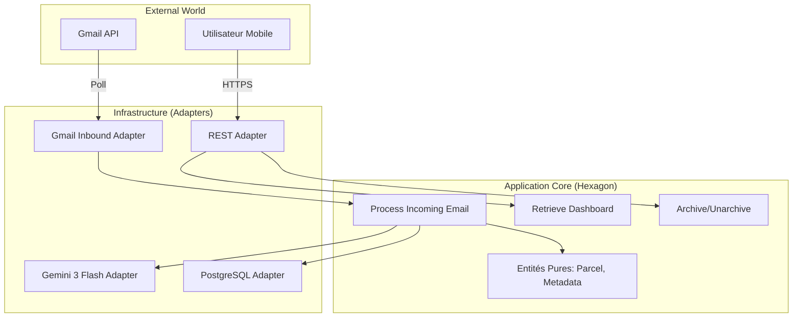

# Architecture Technique : Parcel-Flow

| Méta-donnée | Détail |
| :--- | :--- |
| **Projet** | Parcel-Flow (Portfolio Showcase) |
| **Type** | Architecture Hexagonale Stricte (Ports & Adapters) |
| **Version** | 1.0.0 |
| **Status** | **APPROVED FOR DEVELOPMENT** |
| **Tech Stack** | Java 21, Spring Boot 3.3, Expo SDK 52, Gemini 3 Flash |

---

## 1. Vision & Philosophie
**Parcel-Flow** est une application mobile conçue pour réduire la friction lors du retrait de colis (Vinted, Mondial Relay, etc.).
Au-delà du produit, ce projet est un **Dojo Technique**. Il démontre la capacité à maintenir une architecture propre et découplée dans un contexte moderne.

### Principes Architecturaux (Non-Négociables)
1.  **Hexagone Strict (Domain Purity) :** Le code métier (`domain`) est **Pur Java 21**. Il ne contient **AUCUNE** annotation de framework (pas de `@Service`, `@Entity`, `@JsonProperty`).
2.  **Inversion de Dépendance :** L'Infrastructure dépend du Domaine. Le Domaine ne dépend de rien.
3.  **ATDD First :** Le comportement est défini par des tests d'acceptation (Gherkin) avant l'implémentation.
4.  **Mobile First & Offline :** L'UI est pensée pour un usage en zone blanche (sous-sol, magasin) avec une synchro optimiste.

---

## 2. High Level Architecture

Le système orchestre l'extraction intelligente de données depuis des emails non structurés vers une interface mobile structurée.



---

## 3. Tech Stack (Golden Stack)

Cette configuration est impérative pour garantir la compatibilité des agents IA.

| Catégorie | Technologie | Version | Rôle & Rationale |
| :--- | :--- | :--- | :--- |
| **Backend Lang** | **Java** | **21 (LTS)** | Records, Pattern Matching, Virtual Threads. |
| **Framework** | **Spring Boot** | **3.3+** | Configuration simplifiée, écosystème mature. |
| **AI Orchestration** | **Spring AI** | **1.1.x** | Abstraction LLM. Supporte Gemini, OpenAI, Ollama. |
| **LLM Model** | **Gemini 3 Flash** | **Preview** | Extraction ultra-rapide et économique. |
| **Architecture** | **ArchUnit** | **1.0+** | "Linter d'Architecture" bloquant les violations dans la CI. |
| **Database** | **PostgreSQL** | **16** | Stockage relationnel + JSONB (Métadonnées). |
| **Frontend** | **React Native (Expo)** | **SDK 52+** | Framework mobile. Router v3. |
| **UI Library** | **RN Paper** | **5.x** | Material Design 3 (Theming, Accessibility). |
| **State** | **Zustand** | **4.5+** | Store global minimaliste + Persistance locale. |
| **Testing (Acceptance)** | **Cucumber JVM** | **7.x** | Validation métier (Gherkin). |
| **Testing (Integration)** | **Testcontainers** | **1.19+** | Vrais environnements (Postgres, MockServer) en tests. |

---

## 4. Domain Design (Le Cœur)

Le dossier `backend/src/main/java/com/parcelflow/domain` est sanctuarisé.

### 4.1 Entités & Value Objects
Le modèle anémique est banni. Nous utilisons des **Value Objects** pour encapsuler la validation et la logique métier.

```java
// --- Value Objects (Immutables & Validés) ---

public record ParcelId(UUID value) {
    public ParcelId { java.util.Objects.requireNonNull(value); }
    public static ParcelId random() { return new ParcelId(UUID.randomUUID()); }
}

public record TrackingNumber(String value) {
    public TrackingNumber {
        if (value == null || value.isBlank()) throw new IllegalArgumentException("Tracking Number required");
    }
}

public record PickupPoint(
    String name,       // ex: "ÉPICERIE DES MOINES"
    String rawAddress, // ex: "8 RUE DE L ÉGLISE, 69210 EVEUX"
    String openingHours // ex: "08:30 - 12:30 / 15:00 - 19:00"
) {}

public record PickupCode(
    String humanCode,  // ex: "411612"
    String qrContent   // Contenu brut pour régénération du QR Code UI
) {}

public record Recipient(String name) {} // ex: "Noura Chevin"

public enum Carrier {
    VINTED, MONDIAL_RELAY, CHRONOPOST, UNKNOWN
}

// --- Root Aggregate ---

public record Parcel(
    ParcelId id,
    Carrier carrier,
    TrackingNumber trackingNumber,
    Recipient recipient,
    PickupPoint pickupPoint,
    PickupCode pickupCode,
    LocalDate deadlineDate,
    ParcelStatus status
) {
    public boolean isUrgent() {
        return status != ParcelStatus.ARCHIVED 
            && deadlineDate.isBefore(LocalDate.now().plusDays(2));
    }
}
```

### 4.2 Ports Primaires (Use Cases)
Ces interfaces définissent ce que l'application **PEUT FAIRE**.

* `ProcessIncomingEmailUseCase` : Orchestrateur principal (Fetch Mail -> Extract AI -> Save).
* `RetrieveDashboardUseCase` : Récupère les colis actifs triés par urgence.
* `ArchiveParcelUseCase` : Passe un colis en `ARCHIVED`.
* `UnarchiveParcelUseCase` : Restaure un colis en `PENDING`/`RECEIVED`.

### 4.3 Ports Secondaires (Driven Interfaces)
Ces interfaces définissent ce dont l'application **A BESOIN**.

* `InformationExtractorPort` : `ExtractionResult extract(String rawText)`
    * *Implémentation :* `GeminiFlashAdapter` (Infrastructure).
* `ParcelRepositoryPort` : CRUD operations.
    * *Implémentation :* `PostgresJpaAdapter` (Infrastructure).

---

## 5. Infrastructure & DevOps Strategy

### 5.1 Pipeline CI/CD (GitHub Actions)
Le pipeline applique la stratégie "Supervisor" : validation visuelle obligatoire.

1.  **Backend Quality Gate :**
    * Compilation Java 21.
    * **ArchUnit Check :** Bloque si le package `domain` dépend de `org.springframework` ou utilise `java.lang.reflect`.
    * **Tests :** Unitaires + Cucumber + Integration (Testcontainers).
2.  **Preview Apps :**
    * **Backend :** Déploiement sur **Railway** (URL éphémère `pr-123-api.railway.app`).
    * **Frontend :** Publication sur **Expo EAS Update** (Channel `preview`).
3.  **Notification PR :**
    * Le bot poste un commentaire avec un **QR Code**.
    * *Action Superviseur :* Scan QR Code -> Test sur mobile réel -> Merge.

### 5.2 Web vs Mobile Workflow
* **Dev Loop (Local) :** Le développeur PEUT utiliser `npm run web` pour itérer rapidement sur l'UI (Layout, Couleurs).
* **Validation Loop (PR) :** La validation DOIT se faire sur mobile (via Expo Go / QR Code) pour garantir le fonctionnement des API natives (Luminosité, Haptique).

---

## 6. Structure du Monorepo

```text
parcelflow-monorepo/
├── .github/workflows/      # CI/CD Pipelines
├── docs/                   # PRD, Architecture, ADRs
├── backend/                # Spring Boot Application
│   ├── src/main/java/com/parcelflow/
│   │   ├── domain/         # 🛡️ PURE JAVA (No Spring)
│   │   │   ├── model/
│   │   │   └── ports/      # Interfaces (In/Out)
│   │   ├── application/    # Orchestration des Use Cases
│   │   └── infrastructure/ # 🔌 Adapters (Spring, DB, Gemini)
│   │       ├── api/        # REST Controllers
│   │       ├── persistence/# JPA Repositories
│   │       └── ai/         # Spring AI Client
│   └── pom.xml
├── frontend/               # Expo Application
│   ├── src/
│   │   ├── app/            # Expo Router (Filesystem routing)
│   │   ├── components/     # UI Components (Paper)
│   │   ├── core/           # Business Logic (Services, Stores)
│   │   └── theme/          # Design Tokens
│   └── package.json
└── docker-compose.yml      # Local Dev (Postgres, Mailpit)
```

---

## 7. Next Steps (Handoff)

### Pour l'Agent Product Owner :
* Créer les User Stories Gherkin pour l'Epic 1 ("Foundation") et l'Epic 2 ("Ingestion").
* Focus sur le fichier `.feature` du Use Case `ProcessIncomingEmail`.

### Pour l'Agent Développeur :
1.  Initialiser le Monorepo avec le squelette Maven (Back) et Expo (Front).
2.  Mettre en place la règle **ArchUnit** immédiatement pour empêcher la dette technique.
3.  Implémenter le `Parcel` (Record) et le `ParcelRepositoryPort` avant toute base de données.