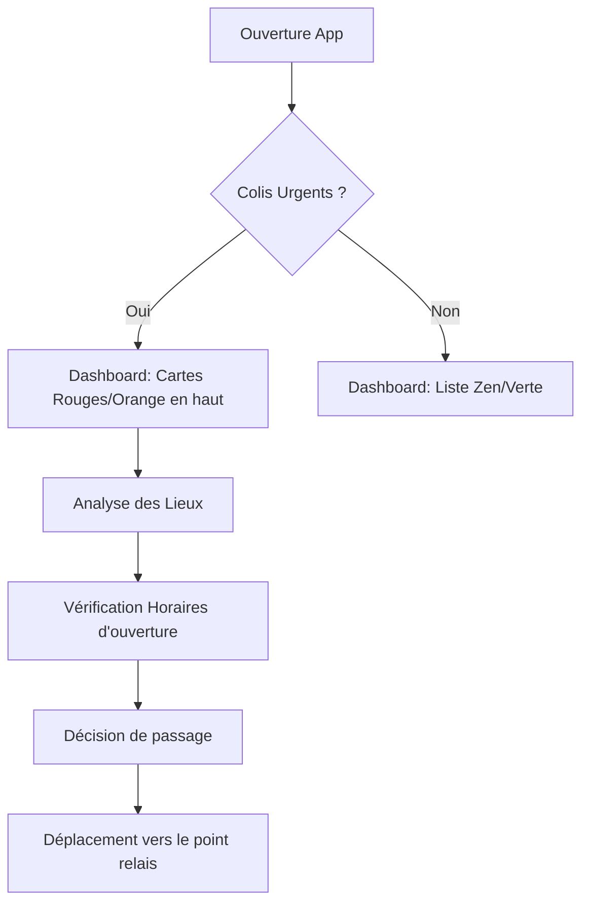
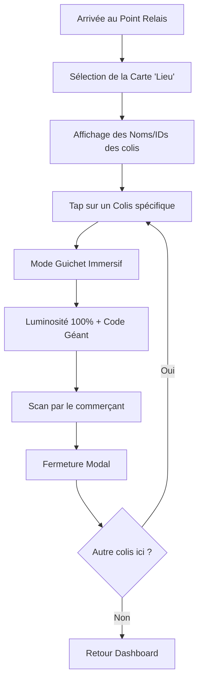

---
stepsCompleted:
  - step-01-init
  - step-02-discovery
  - step-03-core-experience
  - step-04-emotional-response
  - step-05-inspiration
  - step-06-design-system
  - step-07-defining-experience
  - step-08-visual-foundation
  - step-09-design-directions
  - step-10-user-journeys
  - step-11-component-strategy
  - step-12-ux-patterns
  - step-13-responsive-accessibility
  - step-14-complete
inputDocuments:
  - docs/prd.md
  - docs/product-brief.md
  - docs/architecture_v2.md
  - docs/planning-artifacts/epics.md
---

# UX Design Specification Parcel-Flow

**Author:** Antoine
**Date:** 2026-01-19T13:23:43.627Z

---

## Executive Summary

### Project Vision
Parcel-Flow est une application mobile "compagnon logistique" qui transforme le flux chaotique d'emails de livraison en une liste d'actions claire et priorisée. Elle résout le problème des retours involontaires et du stress au guichet tout en servant de vitrine technique pour une architecture logicielle robuste et moderne.

### Target Users
*   **L'Utilisateur Organisé (Primary) :** Cherche à optimiser ses retraits de colis, éviter les pénalités de retard et réduire la friction au moment du retrait. Valorise la confidentialité des données et l'efficacité (offline first).
*   **Le Recruteur Technique (Secondary) :** Évalue la qualité de l'architecture, la maîtrise du code et les choix technologiques (Spring AI, Clean Arch) à travers l'application.

### Key Design Challenges
*   **Confiance & Transparence IA :** Comment rassurer l'utilisateur sur le fait que l'IA a correctement extrait les informations sans qu'il ait besoin de vérifier systématiquement l'email original ? (Gestion des cas d'erreur / incertitude).
*   **Efficacité "Au Guichet" :** L'interface doit être utilisable instantanément dans des conditions stressantes (file d'attente, mains encombrées, mauvaise connexion).
*   **Équilibre UI/Tech :** Le design doit être suffisamment poli pour être crédible en tant que produit fini, tout en restant simple pour ne pas masquer la complexité backend qui est le véritable "héros" du portfolio.

### Design Opportunities
*   **"Traffic Light" Urgency :** Utiliser un code couleur universel et fort pour communiquer l'urgence sans texte superflu.
*   **Mode "Super Bright" :** Une interaction physique (luminosité écran) qui donne un sentiment de contrôle et de "pouvoir" à l'utilisateur au moment critique.
*   **Undo Toast :** Rendre l'archivage fluide et sans peur grâce à une possibilité d'annulation immédiate, renforçant le sentiment de sécurité.

## Core User Experience

### Defining Experience
L'expérience est définie par la **rapidité d'accès** et la **fiabilité**. L'utilisateur ouvre l'application dans un contexte précis et stressant : la file d'attente d'un point relais ou la planification rapide de sa journée. Chaque seconde compte.

### Platform Strategy
*   **Mobile First & Only (React Native):** L'usage est intrinsèquement mobile.
*   **One-Handed Operation:** Les actions principales (sélectionner un colis, archiver) doivent être accessibles à une main (zone inférieure de l'écran).
*   **Native Capabilities:** Exploitation agressive des API natives :
    *   **Luminosité :** Forcée au max en mode guichet.
    *   **Haptique :** Feedback subtil lors de l'archivage ou du rafraîchissement.
    *   **Stockage Local :** Persistance critique pour le mode Offline.

### Effortless Interactions
*   **Auto-Sorting:** Le tri par urgence est automatique. L'utilisateur ne doit jamais se demander "quel colis expire bientôt ?".
*   **One-Tap Code:** Passer de la liste au code de retrait doit se faire en une seule touche, sans chargement visible.
*   **Smart Archiving:** L'archivage doit être un geste fluide ("Swipe") avec un filet de sécurité ("Undo"), rendant l'action sans friction mentale.

### Critical Success Moments
*   **"The Scan Moment" :** Le moment de vérité absolu. L'utilisateur tend son téléphone, le commerçant scanne, ça bipe du premier coup. Succès. Pas de zoom manuel, pas de réglage de luminosité, pas de recherche.
*   **"The Morning Glance" :** L'utilisateur ouvre l'app le matin, voit un indicateur rouge, comprend instantanément qu'il doit passer au point relais ce soir. Charge mentale évacuée.

### Experience Principles
1.  **Réduction de la charge cognitive :** L'information cruciale (Code/Date) prévaut sur tout le reste. Pas de bruit visuel.
2.  **Fiabilité absolue au guichet :** L'app est un outil, pas un média. Elle doit fonctionner "Always On" (Offline).
3.  **Confiance passive :** Le système travaille pour l'utilisateur en tâche de fond. L'interface n'est que la partie émergée de l'iceberg logistique.

## Desired Emotional Response

### Primary Emotional Goals
*   **Sérénité (Relief) :** Transformer l'anxiété du "vais-je retrouver le code ?" en certitude absolue.
*   **Maîtrise (Empowerment) :** Donner à l'utilisateur les outils pour être efficace face au guichetier (luminosité, gros caractères). Il ne subit pas, il agit.
*   **Satisfaction (Completion) :** Le plaisir simple de la tâche accomplie (Inbox Zero appliqué aux colis physiques).

### Emotional Journey Mapping
1.  **Ouverture (Morning) :** *Clarté*. "Je sais ce que j'ai à faire aujourd'hui." Pas de stress, juste de l'info.
2.  **File d'attente (Queue) :** *Confiance*. "J'ai mon code, je suis prêt." Pas de panique de dernière minute.
3.  **Action (Scan) :** *Fluidité*. Ça marche tout de suite. Sentiment de compétence.
4.  **Archivage (Done) :** *Légèreté*. Un poids en moins. Plaisir du "Swipe".

### Micro-Emotions
*   **Incertitude → Certitude :** L'app doit éliminer le doute sur la date limite ou le lieu.
*   **Pression → Efficacité :** Contrer la pression sociale de la file d'attente par une interface ultra-rapide.
*   **Peur de l'erreur (Archivage) → Sécurité :** Le bouton "Undo" transforme une action définitive anxiogène en action réversible rassurante.

### Design Implications
*   **Sérénité :** Design épuré, espaces blancs (Negative Space), typographie lisible. Éviter les couleurs d'alerte agressives sauf nécessité absolue (Expiration < 24h).
*   **Puissance :** Réponses instantanées de l'interface. Pas de loaders bloquants en situation critique.
*   **Satisfaction :** Feedback haptique lors du swipe d'archivage. Animation de disparition fluide.

### Emotional Design Principles
1.  **Calm by Default :** L'interface est calme sauf si une urgence réelle nécessite l'attention.
2.  **Forgiving :** L'erreur est permise (Undo), l'oubli est géré (Rappels passifs).
3.  **Solid :** L'app donne une impression de robustesse, pas de fragilité. Elle est là quand on en a besoin.

## UX Pattern Analysis & Inspiration

### Inspiring Products Analysis
*   **Apple/Google Wallet :** La référence pour le "Moment Guichet". Excellence dans la gestion de la luminosité et la clarté des codes-barres.
*   **Gmail / Superhuman :** Maîtrise du geste "Swipe" pour la productivité et le traitement de listes.
*   **Citymapper :** Excellence dans la hiérarchisation de l'information contextuelle ("Quelle est ma prochaine étape ?").

### Transferable UX Patterns
*   **Contextual Brightness :** Augmentation automatique de la luminosité lors de l'affichage d'un code.
*   **Swipe-to-Archive :** Geste naturel pour traiter les colis récupérés.
*   **Card Hierarchy :** Utilisation de cartes avec des codes couleurs sémantiques pour exprimer l'urgence.

### Anti-Patterns to Avoid
*   **Navigation Profonde :** Éviter de cacher le code derrière plusieurs clics ou menus Hamburger.
*   **Bruit Visuel :** Pas de publicités, pas de suggestions d'achats, pas de fioritures. Uniquement l'info logistique.
*   **Sync Bloquante :** L'utilisateur ne doit jamais attendre une synchronisation réseau pour voir ses codes.

### Design Inspiration Strategy
*   **Adopter :** Le minimalisme de Wallet pour les vues détails.
*   **Adapter :** Le swipe de Gmail pour l'adapter à un contexte mobile "une main".
*   **Éviter :** La complexité des apps de transporteurs (Colissimo, UPS) qui noient l'info utile sous du tracking marketing.

## Design System Foundation

### 1.1 Design System Choice
**Material Design 3 (via React Native Paper)**

### Rationale for Selection
*   **Efficacité de développement :** Bibliothèque de composants exhaustive et robuste pour React Native.
*   **Standards d'accessibilité :** MD3 intègre nativement les meilleures pratiques de contraste et de navigation.
*   **Optimisation IA :** Excellente connaissance du framework par les agents de génération de code (Cursor/v0).
*   **Theming dynamique :** Support natif du Dark Mode et personnalisation aisée des jetons de design.

### Implementation Approach
Utilisation de `react-native-paper` avec un fichier `theme.ts` centralisant les jetons MD3. Intégration de `react-native-vector-icons` (Material Community Icons) pour une iconographie cohérente.

### Customization Strategy
*   **Sémantique des couleurs :** Surcharge des couleurs de surface et de texte pour implémenter le système "Traffic Light" (Vert/Orange/Rouge) sans paraître générique.
*   **Typographie :** Sélection d'une police sans-serif moderne et lisible (ex: Inter ou Roboto) avec une hiérarchie stricte pour mettre en avant les codes de retrait.
*   **Surfaces :** Utilisation modérée des élévations (shadows) pour garder un aspect "plat" et utilitaire.

## 2. Core User Experience

### 2.1 Defining Experience
**"Le Passage en Mode Guichet"** : La transition instantanée d'une liste de gestion à un outil de transaction physique. C'est le moment de vérité où l'application devient un utilitaire matériel.

### 2.2 User Mental Model
Passer du stress de la "fouille d'emails" (chercher une aiguille dans une botte de foin) à l'assurance du "laissez-passer" (présenter une preuve structurée et prête à l'emploi).

### 2.3 Success Criteria
*   **Instantanéité :** Affichage du code en moins de 500ms.
*   **Automatisation :** Luminosité au maximum sans intervention manuelle.
*   **Confiance Haptique :** Vibration légère confirmant l'état "Prêt à scanner".

### 2.4 Novel UX Patterns
Combinaison d'un **Dashboard de priorité** (Feux tricolores) et d'un **Mode Transactionnel Immersif** (Luminosité forcée). L'innovation réside dans l'automatisation des réglages matériels au profit de l'usage contextuel.

### 2.5 Experience Mechanics
1. **Entrée :** Tap sur un colis -> Animation d'expansion.
2. **Transition :** Ouverture d'une vue modale immersive.
3. **Hardware :** SetBrightness(1.0) + HapticFeedback.
4. **Visual :** Code de retrait en gros caractères (Center Stage).
5. **Sortie :** Tap "X" ou Swipe down -> ResetBrightness() -> Retour Liste.

## Visual Design Foundation

### Color System
L'application utilise un système de thèmes hybride pour répondre aux besoins émotionnels et techniques :
*   **Mode Clair (Modern Calm) :** Palette douce et aérée. Utilise des gris colorés (Cool Grays) et des pastels sémantiques pour réduire l'agressivité visuelle tout en maintenant une clarté absolue.
*   **Mode Sombre (Dark OLED) :** Fond noir pur (#000000) pour un contraste maximal et une économie de batterie. Utilise des accents néons subtils pour les états sémantiques.
*   **Système Traffic Light :**
    *   **Urgent :** #FF7675 (Rose/Rouge doux) / #FF5252 (Néon).
    *   **Proche : :** #FDCB6E (Orange pastel) / #FFAB40 (Ambre néon).
    *   **Sécurisé :** #55EFC4 (Menthe) / #69F0AE (Vert émeraude néon).

### Typography System
*   **Police de caractère :** **Inter** (ou police système iOS/Android par défaut).
*   **Ton :** Moderne, géométrique et hautement lisible.
*   **Hiérarchie :**
    *   **Titres (H1/H2) :** Poids 600 (Semi-bold) pour une structure forte.
    *   **Codes de retrait :** Typographie Monospace ou Bold à grande échelle (32pt+) en mode Guichet pour éliminer toute erreur de lecture.
    *   **Labels :** Utilisation de l'échelle Material 3 (Body Medium/Small).

### Spacing & Layout Foundation
*   **Grille :** Système de base de **8px** pour une consistance rigoureuse des marges et paddings.
*   **Densité :** Layout "Aéré" (Comfortable) pour favoriser la lecture rapide.
*   **Composants :** Radius généreux (16px) pour les cartes et boutons, renforçant l'aspect "Calm".

### Accessibility Considerations
*   **Contraste :** Respect strict des ratios WCAG AA (4.5:1) minimum, particulièrement sur les textes sémantiques.
*   **Dynamic Type :** Support des polices agrandies du système.
*   **Cécité des couleurs :** Les états d'urgence ne reposent pas uniquement sur la couleur (utilisation d'icônes ou de labels textuels comme "24h" ou "Prêt").

## Design Direction Decision

### Design Directions Explored
Nous avons exploré 5 variations : Liste Minimale, Empilement de Cartes, Typographie Héroïque, Vue Timeline, et enfin le **Groupement par Lieu (Location Clustering)**.

### Chosen Direction
**Direction 2B : Location-Centric Card Stack (Dark OLED)**
L'interface est structurée autour des points de retrait plutôt que des colis individuels. Ce choix reflète le modèle mental de l'utilisateur : "Je pars faire une tournée de retrait".

### Design Rationale
*   **Efficacité Logistique :** Regrouper les colis par lieu permet d'optimiser les déplacements et de réduire la charge cognitive.
*   **Contexte Temporel :** L'ajout des horaires d'ouverture (ex: "Ferme à 19:00") transforme l'application d'un simple dashboard en un véritable assistant de navigation.
*   **Hiérarchie d'Urgence :** La carte de lieu hérite du statut du colis le plus critique qu'elle contient, garantissant qu'aucune date limite n'est manquée.

### Implementation Approach
Utilisation de cartes Material Design 3 (Surfaces sombres OLED) avec des bordures sémantiques "Traffic Light". Chaque carte contient une sous-liste de colis avec leurs IDs et statuts propres.

## User Journey Flows

### Parcours 1 : Tournée de Retrait
L'utilisateur ouvre l'application pour planifier sa fin de journée.

### Parcours 2 : Moment Guichet (Multi-colis)
L'utilisateur est devant le commerçant et doit présenter ses preuves de retrait.

### Journey Patterns
*   **Contextual Priority :** Les éléments les plus critiques (temps restant) sont toujours en haut.
*   **Hardware Automation :** Le système prend le contrôle des réglages physiques (luminosité) au moment opportun.
*   **Batch Action :** Regroupement par lieu pour minimiser les interactions.

### Flow Optimization Principles
1. **Zéro Friction au Guichet :** Réduire le nombre de taps pour accéder au code final.
2. **Visibilité prédictive :** Afficher les horaires d'ouverture AVANT que l'utilisateur n'ait à les chercher.
3. **Réversibilité :** Archivage facile mais toujours annulable.

## Component Strategy

### Design System Components
Utilisation exhaustive de **React Native Paper (Material 3)** :
*   **Appbar** (Top bar)
*   **Card** (Container des lieux)
*   **List.Item** (Lignes de colis)
*   **Modal** (Mode Guichet)
*   **Snackbar** (Toast Undo)
*   **FAB** (Ajout manuel si besoin)

### Custom Components

#### LocationGroupCard
**Purpose:** Regrouper les colis par lieu de retrait.
**Anatomy:** Badge d'urgence (Traffic Light), Nom du lieu, Statut d'ouverture, Sous-liste de colis.
**Interaction Behavior:** Tap pour ouvrir la vue détaillée/guichet. Swipe pour archiver tout le groupe.

#### CounterModeDisplay
**Purpose:** Présentation plein écran du code de retrait.
**Interaction Behavior:** Déclenche automatiquement `Brightness.setBrightnessAsync(1)`.
**Accessibility:** Gros contraste, police sans-serif épaisse (32pt+).

### Component Implementation Strategy
*   Construction des composants custom sur la base des `Surface` et `Tokens` de RN Paper.
*   Priorité absolue à la lisibilité en extérieur (High Contrast).
*   Feedback haptique intégré aux interactions de succès.

### Implementation Roadmap
1. **Phase 1 (Core) :** `LocationGroupCard` et `UrgencyBadge`.
2. **Phase 2 (Interaction) :** `CounterModeDisplay` et Modal Guichet.
3. **Phase 3 (Finitions) :** Swipe-to-Archive et Snackbar Undo.

## UX Consistency Patterns

### Button Hierarchy
*   **Action Primaire (FAB / Filled) :** Couleur d'accentuation. Utilisé pour "Scanner" ou "Démarrer".
*   **Action Secondaire (Outline) :** Utilisé pour "Détails" ou "Archives".
*   **Action Undo (Snackbar) :** Action temporelle critique pour annuler un archivage accidentel.

### Feedback Patterns
*   **Succès :** Notification Snack-bar non intrusive pour confirmer l'archivage.
*   **Confiance IA :** Badge visuel "À vérifier" si l'IA a un score de confiance faible.
*   **Skeleton Loading :** Placeholder visuel pendant la synchronisation initiale avec Gmail.

### AI Fallback Patterns
*   **Action Corrective :** Bouton proéminent "Ouvrir l'email" si l'extraction est incomplète.
*   **Zéro Édition :** Pas de saisie manuelle dans le MVP. La source de vérité est l'email original.

### Navigation Patterns
*   **Hiérarchie Plate :** Dashboard unique -> Vue Guichet (Modal).
*   **Sortie Intuitive :** Fermeture du mode Guichet par geste (Swipe down) ou bouton de fermeture standard.

## Responsive Design & Accessibility

### Responsive Strategy
*   **Mobile-First & Mobile-Only :** Conception optimisée pour smartphone (usage à une main, extérieur).
*   **Master-Detail sur Tablette :** Affichage en deux colonnes (Lieux à gauche, Détails à droite) pour utiliser efficacement l'espace.

### Accessibility Strategy
*   **Conformité WCAG AA :** Ratios de contraste >= 4.5:1.
*   **Touch Targets :** Zones de clic de 48x48dp minimum pour toutes les actions critiques.
*   **ARIA Labels :** Descriptions textuelles complètes pour les indicateurs visuels (ex: Urgent, Horaires).

### Testing Strategy
*   **Outdoor Testing :** Validation de la lisibilité en plein soleil (luminosité max).
*   **OLED Performance :** Vérification du rendu du thème Dark OLED sur écrans compatibles.

### Implementation Guidelines
*   Utilisation des composants natifs de React Native Paper pour hériter des comportements d'accessibilité du système.
*   Gestion dynamique de la taille de police (Dynamic Type).

<!-- UX design content will be appended sequentially through collaborative workflow steps -->

